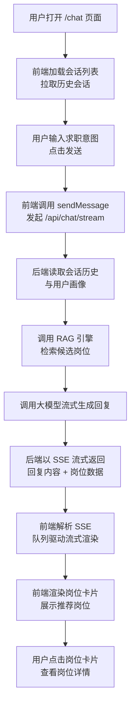
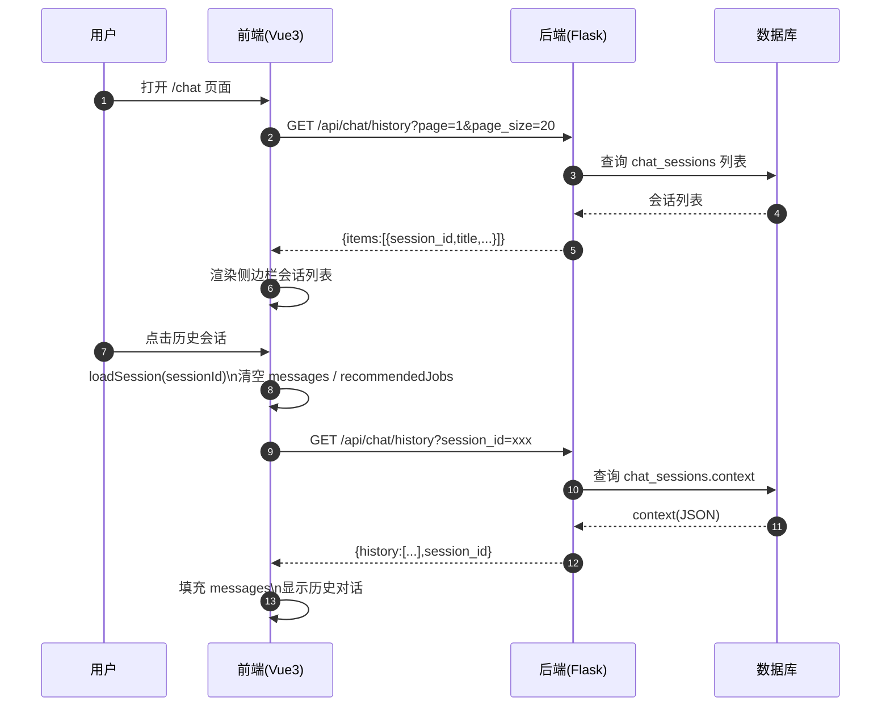
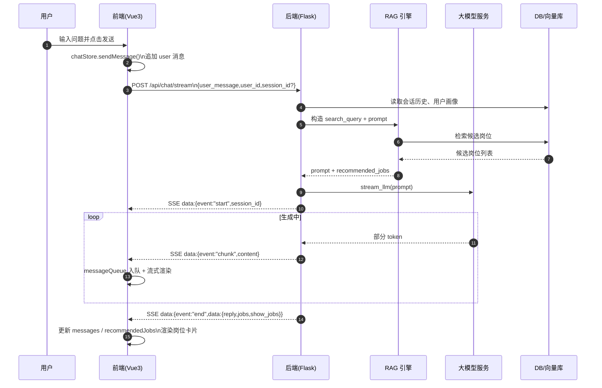

# 前端应用（Frontend）

智能岗位推荐系统的前端单页应用，基于 Vue 3 + Vite，负责对话界面、会话管理、岗位卡片展示以及与后端 SSE 流式交互。

---

## 1. 功能概述

- 对话界面
  - 支持类似 ChatGPT 的多轮对话展示
  - 显示用户与助手的消息气泡
- 会话管理
  - 左侧会话列表，支持查看历史会话
  - 切换会话时自动加载对应历史消息
- 岗位推荐展示
  - 在对话下方渲染岗位推荐卡片
  - 支持点击岗位卡片放大查看详情，右上角圆形关闭按钮
- 流式回复体验
  - 通过 SSE 接收后端流式响应
  - 消息逐字“刷出”，提升交互体验

---

## 2. 项目结构（前端）

```text
Frontend/
  src/
    api/
      chat.js        # 聊天相关接口封装
      jobs.js        # 岗位相关接口封装
    components/
      ChatInput.vue  # 输入框与发送按钮
      ChatSidebar.vue# 会话列表与会话切换
      ChatWindow.vue # 对话消息 + 岗位卡片 + 详情弹层
      JobCard.vue    # 单个岗位卡片组件
    router/
      index.js       # 路由配置（/chat）
    store/
      chat.js        # 使用 Pinia 管理会话、消息、推荐岗位等
    utils/
      sse.js         # 封装 SSE 协议解析与流式回调处理
    views/
      ChatPage.vue   # 主页面布局（侧边栏 + 内容区）
    App.vue          # 根组件
    main.js          # 应用入口，挂载 Vue 应用
  index.html
  package.json
  vite.config.js
```

### 2.1 关键组件职责

- `ChatPage.vue`
  - 整体布局容器，组合侧边栏、聊天窗口与输入框
- `ChatSidebar.vue`
  - 展示会话列表，支持新建和切换会话
  - 挂载时调用 `chatStore.fetchSessionList` 拉取会话列表
- `ChatWindow.vue`
  - 展示当前会话的所有消息
  - 下方展示推荐岗位卡片网格
  - 维护 `selectedJob`，控制岗位详情弹层的显示/隐藏
- `ChatInput.vue`
  - 负责用户输入与发送操作
  - 调用 `chatStore.sendMessage` 触发一次完整对话流程
- `JobCard.vue`
  - 展示岗位名称、公司、城市、薪资、简要描述等信息
  - 点击后向上层 emit 当前岗位，触发详情弹层
- `store/chat.js`
  - 统一管理前端状态：
    - `sessions`、`messages`、`recommendedJobs`
    - `currentSessionId`、`isStreaming` 等
  - 提供 `fetchSessionList`、`loadSession`、`sendMessage` 等核心 action
- `utils/sse.js`
  - 使用 `fetch` + `ReadableStream` 手动解析 `text/event-stream`
  - 对 `start/chunk/end` 事件做分发，供 `chatStore` 挂接回调

---

## 3. 关键技术点

- 技术栈
  - `Vue 3` + Composition API
  - `Pinia` 作为状态管理
  - `Vite` 作为构建工具
  - UI 组件库可按需引入（如 Element Plus）
- 状态管理与模块划分
  - 使用 `store/chat.js` 管理会话、消息和推荐岗位
  - 组件之间通过 props/emit 与 store 解耦
- 流式渲染实现
  - 前端通过 `utils/sse.js` 调用 `/api/chat/stream`
  - 解析 SSE 流中 `start/chunk/end` 事件
  - 使用消息队列和 `requestAnimationFrame` 将文本增量追加到当前 assistant 消息，实现“字逐渐刷出”的效果
- 体验优化
  - 加载历史消息时显示加载状态，避免空白闪烁
  - 在流式回复阶段可显示“正在生成”提示
  - 岗位卡片布局自适应，详情弹层适配不同屏幕尺寸

---

## 4. 系统与交互流程图（前端视角）


### 4.1 系统整体流程图（高层）



---

### 4.2 会话与历史消息加载流程图



---

### 4.3 聊天与 SSE 流式响应流程图



---

## 5. 项目启动
- sh
# 本地开发
环境要求
`Node >=20.19.0（或 >=22.12.0）`
npm / pnpm / yarn（示例以 npm 为准）
岗位推荐 AI Agent 后端服务，默认地址：`http://127.0.0.5000`
# 安装依赖
`npm install`
# 启动开发服务器
`npm run dev`
默认使用 Vite 开发服务器`（通常为 http://localhost:5173）`， 通过代理 / 直连方式访问后端 `http://127.0.0.1:8000`。

# 构建与质量检查
生产构建
`npm run build`
-

默认通过 Vite 启动开发服务器，前端在本地运行并通过 `/api/*` 与后端交互。
